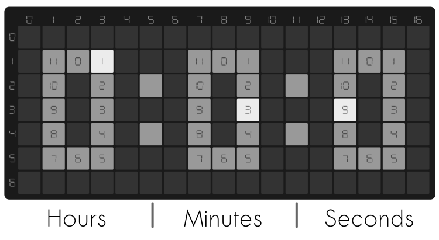

# Scroll pHAT HD Rectangle Watch
    

This is a base 12 watch using raspberry pi zero and Pimoroni Scroll pHAT HD.

## Hardware
- [Raspberry Pi Zero WH](https://www.adafruit.com/product/3708)
- [Pimoroni Scroll pHAT HD](https://www.adafruit.com/product/3473)
Optional
- [Pibow Zero Case](https://www.adafruit.com/product/3005) 

### Power 
With USB connection, it use 0.05A to 0.08A at 4.92V.

## Time
- Hours: converted to 12 hour, hour starts from 0 to 11.
- Minutes: divided by 5 then add 0.5 and convert the number to an integer.
- Seconds: divided by 5 then add 0.5 and convert the number to an integer.
If you have problem with NTP, port block or ISP block, use [HTTP Time protocol](http://www.vervest.org/htp/).
Example of time:
- 12:45:25 = 12:9:5
- 19:29:33 = 7:6:7

## Setup 
- [Raspberry Pi Zero Headless Quick Start](https://learn.adafruit.com/raspberry-pi-zero-creation)
- [Scroll pHAT HD installation](https://github.com/pimoroni/scroll-phat-hd#manual-install)

## Code
`get_loc` function takes x starting point and the number needed to be shown, return the location of the dot.
`show_time` function to create 3 dim rectangle and call `get_loc` to get location of hour,minute and second.

### Reference
[Scroll pHAT HD Documentation ](http://docs.pimoroni.com/scrollphathd/)
[How to Set the Time and TimeZone on the Raspberry Pi](http://kamilslab.com/2018/09/18/how-to-set-the-time-and-timezone-on-the-raspberry-pi/)